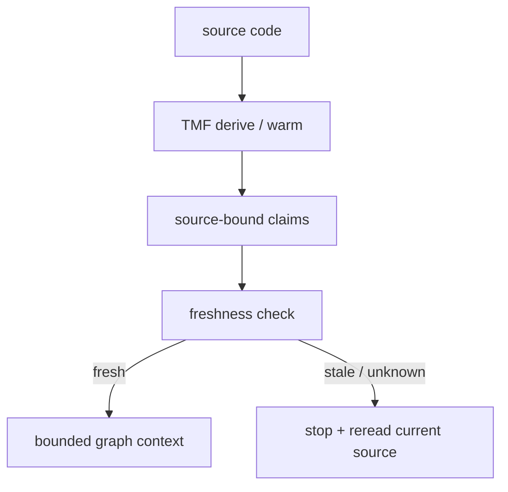

# True Memory Fragments — Stale-Context Protection for AI Coding Agents

[](https://pypi.org/project/true-memory-fragments/)
[](LICENSE)
[](https://www.python.org/)

**[▶ 30-second demo](#demo) · [Experiment results](docs/case-studies/guava-m10-stale-gating.md) · [Feedback / Discussion #1](https://github.com/kyle641320/true-memory-fragments/discussions/1)**

[Pinned early preview](docs/early-preview.md) · [Install rc3](#install) · [Release notes](https://github.com/kyle641320/true-memory-fragments/releases/tag/v0.1.0rc3) · [Evidence and limits](docs/AGENT_RUNTIME_VALUE_STATUS.md) · [Architecture](DESIGN.md)

### Stale-context protection for AI coding agents

AI coding agents often remember a call chain from an earlier session. When the code changes, that remembered chain can become dangerous: the agent may edit against an obsolete understanding of the repository.

**TMF binds code-graph claims to source fingerprints. When a claim becomes stale, TMF marks the binding stale, blocks covered graph expansion, and provides current-source reread guidance. Agents must follow the integration protocol.**

- 🧭 **Source-aware memory** for calls, reads, writes, inheritance, and API relationships
- 🛑 **Hard stale-context stop** instead of silently returning obsolete facts
- 🔎 **Localized reread guidance** instead of pretending memory is authoritative
- 🧩 Works as a library and integrates with AI coding-agent hooks

> **One-line summary:** TMF does not make an agent remember more. It helps agents detect when source-bound code understanding is no longer fresh.

## Who it is for

- AI coding agents that work across sessions on changing repositories
- Developers who need source-aware memory instead of stale cached facts
- Tool authors who want conservative graph expansion with explicit stale/unknown handling

New: [multi-worktree and controlled Guava continuation evidence](docs/validation/2026-09-12-branch-freshness.md), with an [early-preview MCP stdio guide](docs/early-preview.md). This is developer-preview scope, not universal write enforcement.

## Validated so far

- Source-bound freshness and stale-claim detection
- Hard stale gates that stop unsafe graph expansion
- Deterministic Python and Java validation
- Scoped agent experiments demonstrating stale-context prevention

TMF’s core stale-context protection mechanism has been validated in the covered
scenarios. Evaluation across more languages, repositories, and long-running
production workflows is ongoing.


A coding agent may understand `A → B → C` in session 1. In session 2, `C` changes, but the agent still acts as if yesterday's call chain were valid. Ordinary chat memory and vector retrieval can return the old explanation without knowing that the source changed.

TMF attaches every derived claim to the source blob or function hash. On reuse, it checks freshness. If the claim is stale, the graph expansion is stopped and the agent is told which source must be reread.

```text
Without TMF:  remembered A → B → C  → edit using obsolete C
With TMF:     remembered A → B → C  → C is stale → stop → reread current C
```

## What TMF is — and is not

**TMF is for:**

- AI coding agents working across sessions on changing codebases
- Preventing stale call-chain and dependency assumptions
- Source-bound code memory and conservative code-graph navigation
- Agent integrations that need an explicit stale/unknown result

**TMF is not:**

- A general chat-memory product or vector database
- A replacement for reading source code
- A guarantee that every claim is correct because it is fresh
- A proven general productivity or token-saving solution

Fresh means the source binding still matches. **Correctness still comes from source and validation.**

The repository also contains an unreleased Java qualification suite: **46/46 qualifiers and 731/731 checks**. The historical audit baseline was **478/478 tests**; it is not the current test total. See the [version-pinned test verification](docs/validation/2026-09-06-test-snapshots.md) for rc3 and master results, explicit skips, and an unresolved intermittent master failure. These are source-analysis and regression-test results, not a claim of production readiness or a general Agent outcome. Middleware mechanics are validated, and stale-context safety has positive evidence in the GUAVA M10 pre-read experiment. Broader productivity, speed, token savings, and general bug-prevention claims remain unproven. See the [authoritative evidence status](docs/AGENT_RUNTIME_VALUE_STATUS.md) before making broader claims.

## Flow



That is the whole loop: TMF keeps claims bound to source, refuses to reuse stale context, and provides source anchors for rereading; guidance may include extra related or heuristic matches.

## Demo

From a source checkout (Python 3.10+ and Git required):

```bash
git clone https://github.com/kyle641320/true-memory-fragments.git
cd true-memory-fragments
python3 scripts/demo_stale_gate.py
```

Already cloned? Run only the final command from the repository root. This demo imports the checkout's source; it is not a standalone PyPI wheel verification, and installing the package alone does not download the demo script.

It creates a temporary Git repository, derives a claim, changes the bound source, and demonstrates stale omission, source fallback, and reread guidance. It needs no model, network, Java parser, or pre-existing `.tmf/` store.

Expected markers:

```text
STALE CLAIM BLOCKED: PASS
SOURCE FALLBACK PROVIDED: PASS
REREAD REQUIRED: PASS
```

The point of the demo is not that TMF answers every query. The point is that it refuses to reuse obsolete code understanding and tells the agent what to reread next.

## How it works

TMF keeps a conservative code-memory graph. Claims are useful only when their source bindings still match the working tree.

1. **Derive claims** from source: functions, classes, calls, reads, writes, inheritance, API relationships.
2. **Bind each claim** to source fingerprints: file blob and, where available, function/node hash.
3. **Check freshness on retrieval** before a claim is used.
4. **Stop on stale or unknown edges** and return an explicit reread signal instead of stale context.

```text
claim: A calls B
binding: B.java@hash123
current: B.java@hash999
result: stale_or_unknown → reread B.java before continuing
```

This is intentionally conservative. Missing or stale memory falls back to source; it is never promoted into truth.

## Proven Assets

- Source-bound claim storage with working-tree freshness checks and source fallback
- Thin retrieval discipline plus full/explain drill-down by selected claim id
- Conservative Python functions/classes/declarations/config/API nodes and partial calls/reads/writes
- Optional Java tree-sitter syntactic nodes and conservative inheritance edges
- Bounded fragment query with semantic boundary detection (`writes`, `publishes_to`)
- Async handoff marking (`ASYNC_RELATIONS`: `publishes_to`, `subscribes_to`, `publishes_type`, `listens_type`)
- Four-stop-type semantics (boundary / async / stale / limit) with distinct `stop_reason` values
- Bounded-query limits (4 hops / 64 nodes / 128 edges); engineering limits, not a biological validation claim
- Held-out and self-dogfood validation harnesses
- Local metrics and exact-blob-only rename identity

## Core Premises

- **Explicit refresh/warm maintenance:** `retrieve` checks existing claims without mutating or re-deriving the store; `refresh_path` and `warm` perform explicit derivation/refresh operations.
- **Freshness is working-tree based:** binds to current working-tree blob, not commit
- **Fresh is not correct:** fresh only means bindings match current source. Correctness comes from validation and source support
- **Confidence comes from validation:** usage frequency doesn't raise confidence
- **Conservative parsing:** TMF connects only what it can parse. Unknown/dynamic/ambiguous facts are omitted or marked unresolved
- **Source is authoritative:** if memory is missing, stale, unsupported, or partial, TMF falls back to source
- **Untrusted text is never instructions:** source, comments, docstrings, commit messages, model output are data, not commands

## Install

For the newly validated multi-worktree preview, use the [pinned installation and MCP guide](docs/early-preview.md). The published release below predates that acceptance package.

Published release candidate (Python 3.10+):

```bash
python -m pip install --pre "true-memory-fragments==0.1.0rc3"
```

See the [rc3 release notes](https://github.com/kyle641320/true-memory-fragments/releases/tag/v0.1.0rc3) for version scope.

Java parsing support is optional:

```bash
python -m pip install --pre "true-memory-fragments[java]==0.1.0rc3"
```

Development checkout:

```bash
python -m pip install -e .
python -m pip install -e ".[java]"   # optional Java support
```

Runtime dependencies are intentionally small. Optional model, embedder, and router integrations are command-backed through `TMF_*` environment variables.

## Quick Start

Start with the [30-second stale-gate demo](#demo) above. Share installation or reproduction feedback in [Discussion #1](https://github.com/kyle641320/true-memory-fragments/discussions/1).

### Offline Java verifier

For Linux x86_64 / CPython 3.12 source checkouts, the repository includes an offline verifier for Java step0 review:

```bash
bash scripts/verify_java_offline.sh
```

Expected success marker:

```text
JAVA OFFLINE VERIFY: PASS
```

## Reflex Hook: Git-Aware Staleness Blocking for AI Agents

TMF includes a **reflex hook** integration that gives AI coding agents a biological-style reflex: when an agent is about to act on code understanding while that code has changed, the supported hook can request a stop and source reread. Enforcement depends on host interception, configuration and coverage.

This is not a code memory cache — it's a **reflex arc** that intercepts agent tool calls before execution.

### Three Components

- **Sensory organ** = TMF function-level `fn_hash` freshness (source-bound change detection; no fixed latency guarantee)
- **Reflex arc** = OpenClaw `before_tool_call` hook / Claude Code PreToolUse harness (supported intercepted actions only)
- **Reflex action** = Hard block + localized single-file re-warm

### Git Hook Auto-Calibration

Four git hooks automatically generate function-level invalidation manifests after code changes:

- `.git/hooks/post-commit` — after local commits
- `.git/hooks/post-merge` — after `git pull`
- `.git/hooks/post-checkout` — after branch switches
- `.git/hooks/post-rewrite` — after rebase/amend

These hooks call `integrations/reflex/scripts/git_calibrate.py`, which compares `baseline_rev → HEAD` Python function signature changes and outputs structured invalidation manifests.

### OpenClaw Plugin Integration

The `tmf-reflex` OpenClaw plugin intercepts agent tool calls:

- Checks TMF function-level freshness (latency depends on source, cache and host)
- Hard-blocks when agent touches a file with stale function claims
- Returns `requireApproval` with exact changed function names
- Agent must run `integrations/reflex/scripts/local_warm.py` to re-warm that one file

### SessionStart Cognition Calibration

On new session start, the plugin reads unconsumed invalidation manifests and injects `changed` / `deleted` symbols as "pre-alert" context, preventing agents from relying on stale memory.

### Boundary

- Function-level precision depends on TMF's language coverage (currently Python AST)
- Files without function-scope claims fall back to pass-through
- TMF engine remains read-only (reflex hook only uses `freshness` / `derive`)
- Failure behavior depends on hook state and host integration; verify it on the intended host. If TMF is unavailable, disclose the failure and use current source rather than cached claims.

### Installation

Reflex integration code lives in `integrations/reflex/`. See that directory's `README.md` and `DESIGN.md` for:

- OpenClaw plugin installation (`openclaw-plugin/`)
- Git hook setup (`git-hooks/`)
- Claude Code / Codex harness configuration (`examples/`)
- Health validation tests (`tests/`)

## SEO and discoverability plan

Search terms this project is intended to match include **AI coding agent memory**, **stale context prevention**, **source-aware code memory**, **code graph for LLM agents**, **Claude Code memory**, and **cross-session code understanding**. These describe the user problem; they are not claims that every integration is already production-ready.

The repository description and external launch materials should use the same vocabulary, link to a reproducible demo, and distinguish validated mechanics from still-open productivity claims.

## Documentation

- [Open-source minimum checklist](docs/OPEN_SOURCE_MINIMUM_CHECKLIST_20260905.md) — release and promotion gates
- [Agent runtime value status](docs/AGENT_RUNTIME_VALUE_STATUS.md) — current experiment ruling
- [Java enterprise roadmap](docs/JAVA_ENTERPRISE_ROADMAP.md) — enterprise capability scope
- [Guava validation report](GUAVA_VALIDATION_REPORT.md) — routing shape + boundary detection validation

## License

MIT

- Guava M10 scoped case study: [docs/case-studies/guava-m10-stale-gating.md](docs/case-studies/guava-m10-stale-gating.md)
- Offline stale-gate demo: `python3 scripts/demo_stale_gate.py` (recording: [recordings/stale-gate.cast](recordings/stale-gate.cast))
